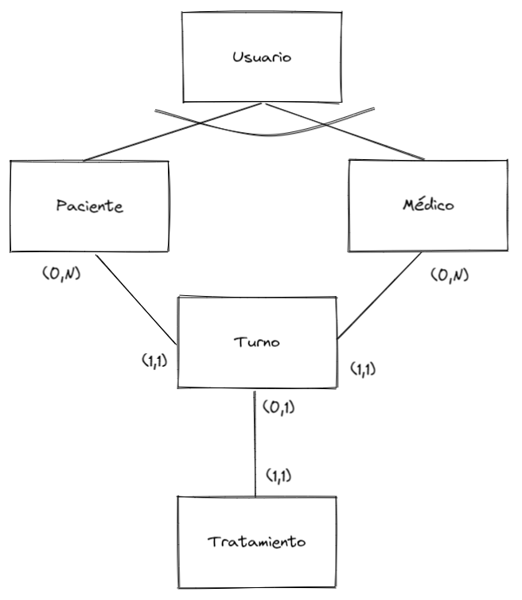

# dswnodejs-final

Trabajo práctico **final** para el curso de Desarrollo de Servicios Web con NODEJS

## Autenticación

Se agrega el feature de autenticación vía email y password tanto para el médico como para el paciente (a través de una nueva entidad de la que "heredan" y determina el rol que cumplen en el sistema), y se utiliza JWT para acceder a las rutas específicas.

## Relaciones del modelo de datos

Se presentan 6 modelos para manejar el sistema de turnos del hospital
- Usuario: información relativa al logueo del paciente y el médico
  - id
  - email
  - password

- Paciente: información relativa al paciente
  - id
  - nombre
  - apellido
  - fecha_nacimiento

- Médico: información relativa al médico
  - id
  - nombre
  - apellido
  - especialidad

- Tratamiento: información tabulada sobre los tratamientos posibles
  - id
  - descripción

- Turno: información sobre la relación entre el paciente, el médico y el tratamiento (si lo hubiese)
  - id
  - fecha
  - observaciones

- Estudio: información sobre los posibles estudios (y sus archivos) asociados al turno
  - id
  - nombre
  - observaciones
  - archivo
  - archivo_nombre

